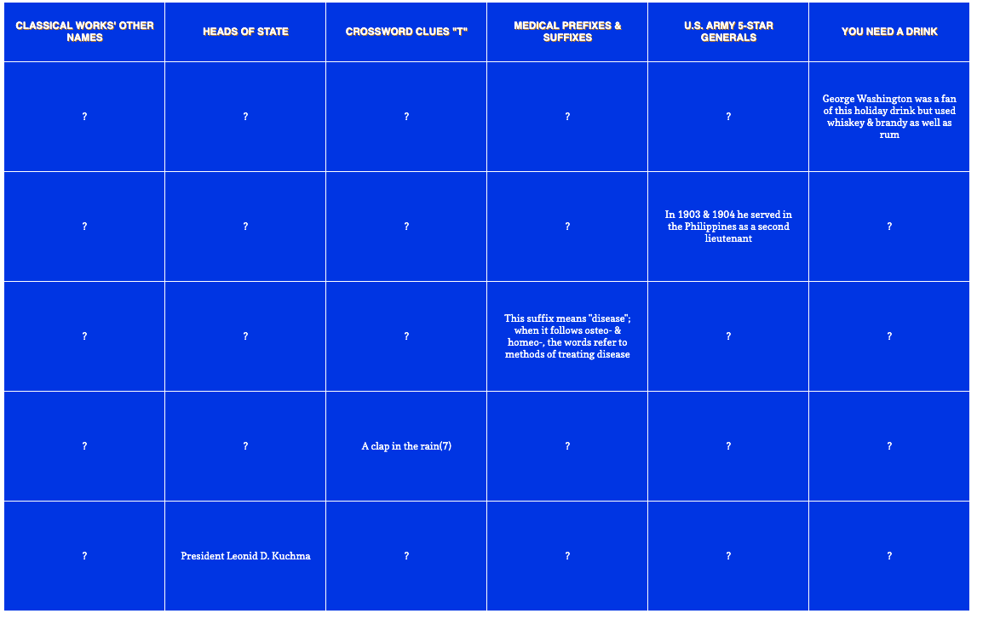
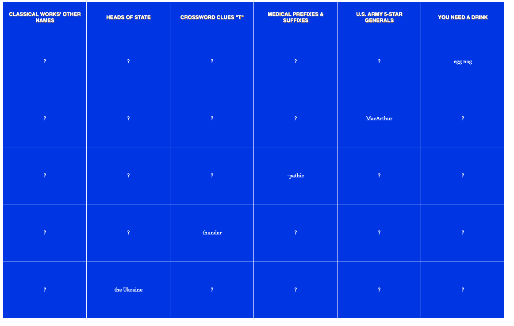

# Jeopardy 

My recreation of the classic trivia game Jeopardy using Jeopardy API. 

## About

This goal of the project was to utilize Object Oriented Programming paradigm along with Test Driven Development. 

### Rules
Each game, there will be 6 random categories as well as 6 random questions of each category. 
- Click "Start Game"
- Click on each question "?" under your desired category to reveal the question

- When you're ready click on it again for the answer. 

## Try it live! 
[Jeopardy](https://nyancodes.github.io/jeopardy/) on Github Pages

#
